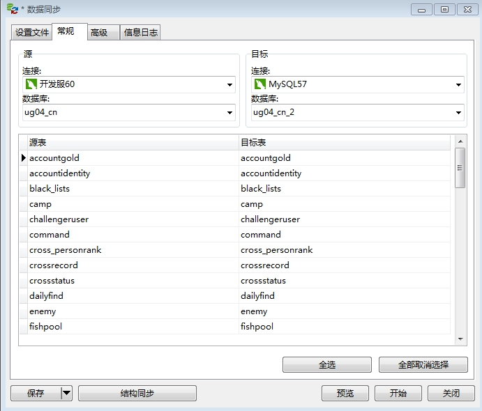

# Work CheatSheet

## 插命令

```mysql
# 热更，更多类型见：RELOAD_CONFIG_TYPE
insert into command (creator, type, cmd) values ("background", 2, "Cmd Reload 6 0 0" );
```

## 将消耗物品设置为自动购买

策划配置：

- 打开表格：W-被动消耗类.xls

- 设置物品的字段：get_way，将第一个内容设置为0。

服务端相关接口：Knapsack::ConsumeItemAutoBuy

## 修改传闻

打开传闻文件：config\serverconfig\string.xml

找到对应的字符串，直接修改其内容即可。

注意：不能调整%的位置，不能删除%，如果需要调整，就得找服务端改对应的代码。

## 修改错误码

修改错误码需要服务端改代码。

如果错误码提示很奇怪，那么有可能是客户端没有更新新的错误码。

## 敏感词

如果是名字类的敏感词，由服务端处理。

如果是比较长的，比如聊天的，由客户端处理。

## 日志报错

SeriousError (Critical): [Knapsack::Init Error]

可能是由于策划在itemmanager.xml中删除了某个item的配置，导致玩家身上的该物品读取配置失败。

## 拉取开发服数据

打开Navicat，菜单栏选工具 -> 数据同步，选择要同步的数据库：



点击开始同步开发服数据到本地数据库。

然后设置local.xml，将开发服加入合服列表。

```xml
<!-- 允许的服ID列表 -->
<allow_server_id_list>
	<server_id>2</server_id>
	<server_id>1</server_id>	
</allow_server_id_list>
```

之后就可以使用开发服的角色登陆本地服了。